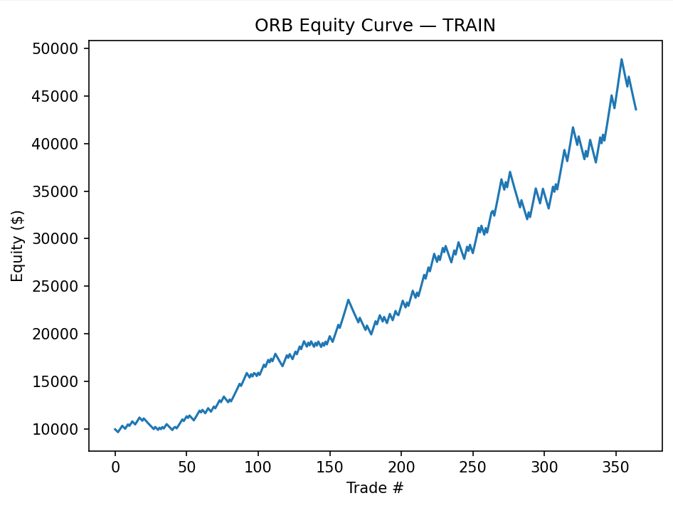
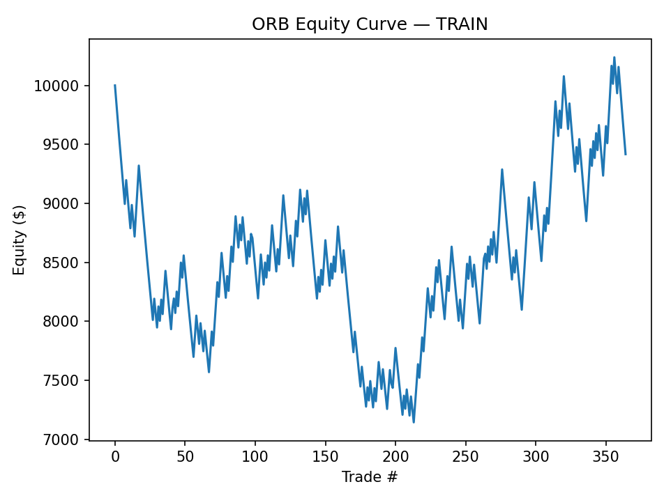
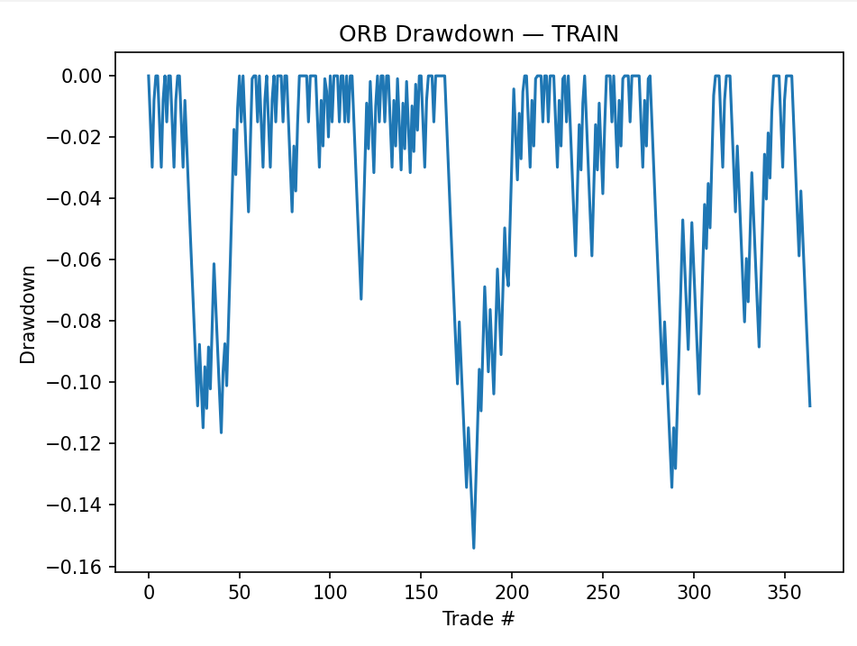
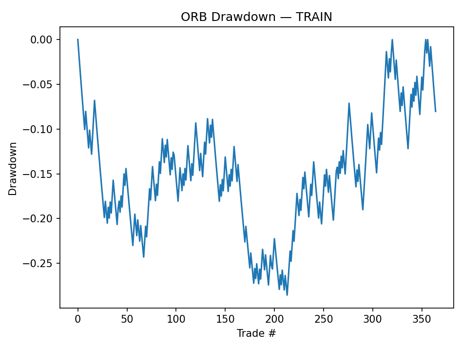
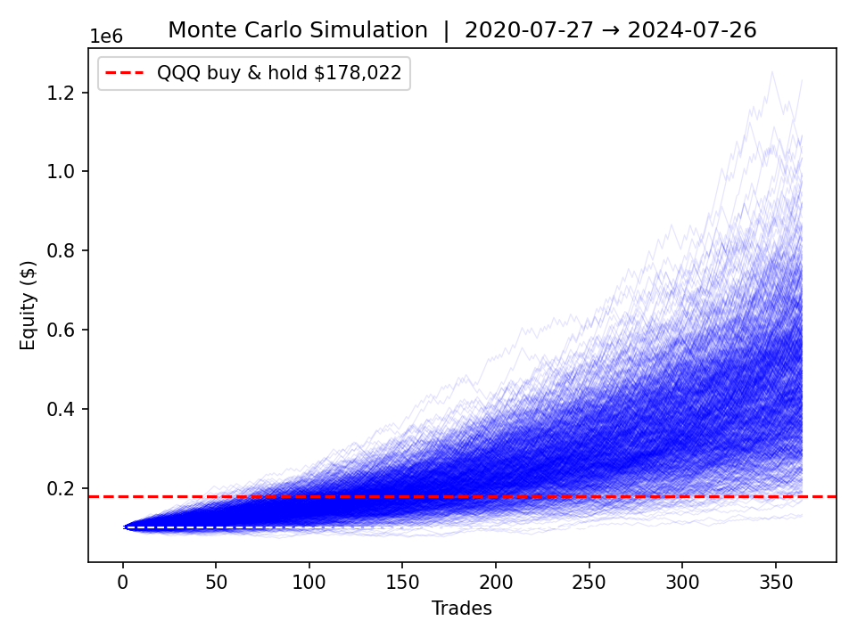
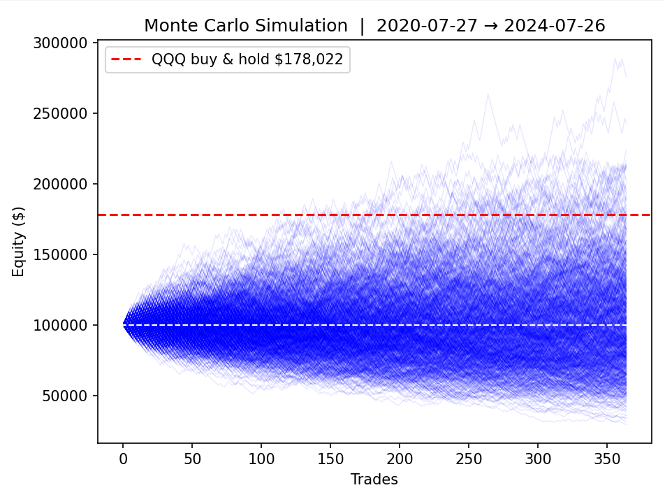

# Results — Before vs After the Fix

Same strategy, same data, same train period (2020-07-27 → 2024-07-26). The only change is the one-line fix described in the [README](README.md) — trade management now starts on the bar *after* a limit fill instead of on the fill bar itself.

---

## Equity Curve

| Before Fix | After Fix |
|---|---|
|  |  |
| $10,000 → **$43,575** | $10,000 → **$9,417** |

**Note:** both runs start at $10,000. The "before" (buggy) version climbs to $43,575 over the train period. The "after" (fixed) version actually ends *below* its starting capital, at $9,417 — net negative over the same period, same trades.

---

## Drawdown

| Before Fix | After Fix |
|---|---|
|  |  |
| Max drawdown: **-15.4%** | Max drawdown: **-28.6%** |

The "before" version shows a strategy that dips, recovers to new highs three separate times, and climbs steadily. The "after" version shows a strategy that spends most of its life underwater, with one drawdown stretch alone reaching -28%.

---

## Monte Carlo Simulation (1,000 runs, $100,000 starting equity)

| Before Fix | After Fix |
|---|---|
|  |  |
| Median outcome well above QQQ buy & hold ($178,022) | Median outcome roughly **in line with starting equity** — the bulk of simulated outcomes cluster around $50k–$120k, well below buy & hold |

This is the clearest illustration of the bug's impact. The "before" Monte Carlo fan shows a strategy that reliably and significantly outperforms passive buy & hold across nearly every simulated path. The "after" fan shows a strategy that, at best, roughly tracks its starting capital — with a meaningful share of simulated paths losing money entirely.

---

## Takeaway

Every one of these charts is generated from the exact same trade-taking logic — same entries, same opening ranges, same dates. The only thing that changed is *which bar is allowed to resolve the trade*. That single assumption was responsible for the entire appearance of edge.
